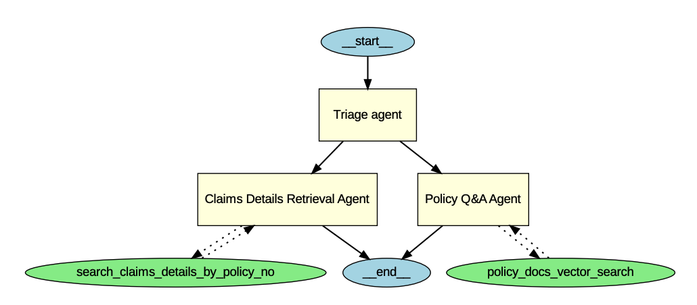

# Building a multi-agent system with OpenAI Agents SDK on Databricks

Author: 
* [David Huang](https://www.linkedin.com/in/davidihuang/)
* [Qian Yu](https://www.linkedin.com/in/qyupublic/)

In this repo, we show how to build, deploy and test a multi-agent system that can answer insurance claim and policy questions using OpenAI Agents SDK on Databricks.

## Reference:

* [Databricks Agent Tools](https://docs.databricks.com/aws/en/generative-ai/agent-framework/agent-tool)
* [Use MLflow ChatAgent to Author agents](https://docs.databricks.com/aws/en/generative-ai/agent-framework/author-agent#-use-chatagent-to-author-agents)
* [Unity Catalog AI Integration](https://github.com/unitycatalog/unitycatalog/tree/main/ai/integrations)
* [Log and Register Agent on Databricks](https://docs.databricks.com/aws/en/generative-ai/agent-framework/log-agent)